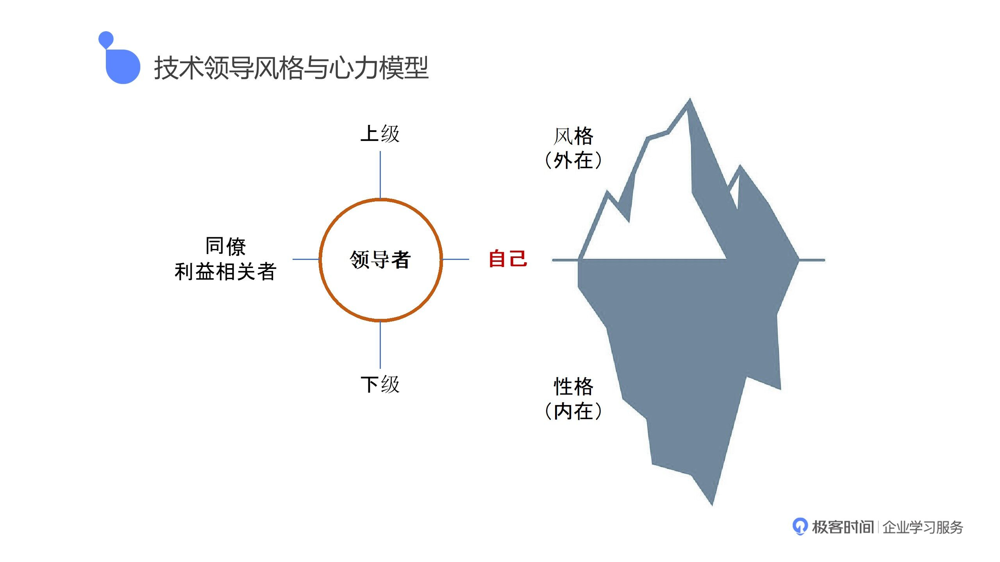

来自平安HRX资深数据总监 钱勇的分享（[time.geekbang.org](https://time.geekbang.org/column/article/376689?source=app_share)）

<!--more-->

**二、技术领导风格与心力模型**

作为技术领导者，要处理很多关系，跟上级的关系，跟下级的关系，跟兄弟部门的关系，以及跟客户、合作伙伴的关系，所以技术领导其实很累。但是有没有关照过自己的内心？其实我们想处理好跟其他人之间的关系，最核心的要先处理好自己跟自己的关系。

心力构成的如一个冰山模型，底层看不见的 才是我们的内在，上面所谓的领导风格是我们要扮演的角色，有时候这两者未必是一致的，风格和内在性格没有关联，内心的纠结可能会无法面对，这就是一个我们要破解的一个难题。



心力是告诉我们，当你成为一个技术管理者，当你内心纠结的时候，你是无法求外的，力量的源泉一定来自于你的内心。

思考：

任何一个角色，处在生活或者工作当中，其承担的职责都是巨大的，其承受的压力也是巨大的，抗压能力的强弱，就直接体现了其直面困难的勇气，以及能否不断挑战自己的决心。
