聊一下IoC和AOP原理在Dubbo中的应用。
<!--more-->
# 1、回顾与复习：

### 1.1、dubbo的基本设计原则

采用 Microkernel + Plugin 模式，Microkernel 只负责组装 Plugin，Dubbo 自身的功能也是通过扩展点实现的，也就是 Dubbo 的所有功能点都可被用户自定义扩展所替换。

采用 URL 作为配置信息的统一格式，所有扩展点都通过传递 URL 携带配置信息。

### 1.2、Dubbo中的增强SPI

Dubbo的扩展点加载机制是基于JDK标准的SPI扩展机制增强而来的，Dubbo解决了JDK标准的SPI的以下问题：

- JDK标准的SPI会一次性实例化扩展点的所有实现，如果有些扩展实现初始化很耗时，但又没用上，那么加载就很浪费资源。
- 如果扩展点加载失败，是不会友好地向用户通知具体异常的，没有显示的指名失败原因。
- 增加了对扩展点IoC和AOP的支持，一个扩展点可以直接使用setter（）方法注入其他扩展点，也可以对扩展点使用Wrapper类进行功能增强。

### 1.3、扩展实践案例

**扩展接口**

org.apache.dubbo.common.compiler.Compiler

**现有扩展**

- `org.apache.dubbo.common.compiler.support.JdkCompiler`
- `org.apache.dubbo.common.compiler.support.JavassistCompiler`

**扩展式例**

```xml
`src`
 `|-main`
    `|-java`
        `|-com`
            `|-xxx`
                `|-XxxCompiler.java (实现Compiler接口)`
    `|-resources`
        `|-META-INF`
            `|-dubbo`
                `|-org.apache.dubbo.common.compiler.Compiler (纯文本文件，内容为：xxx=com.xxx.XxxCompiler)`

`package com.xxx;`
`import org.apache.dubbo.common.compiler.Compiler;`
`public class XxxCompiler implements Compiler {`
    `public Object getExtension(Class<?> type, String name) {`
        `// ...`
    `}`
`}`

`xxx=com.xxx.XxxCompiler`
```


## 2、Dubbo中的IoC：

### 2.1、Spring 中的 IoC

**控制反转**（Inversion of Control，简称 IoC），是面向对象编程中的一种设计原则，可以用来减低计算机代码之间的耦合度。其中最常见的方式叫做**依赖注入**（Dependency Injection，简称 DI），还有一种方式叫“**依赖查找**”（Dependency Lookup）。

通过控制反转，对象在被创建的时候，由一个调控系统内所有对象的外界实体，将其所依赖的对象的引用传递(注入)给它。

**两种实现：依赖查找（DL）和依赖注入（DI）。**

**IOC 和 DI 、DL 的关系：**


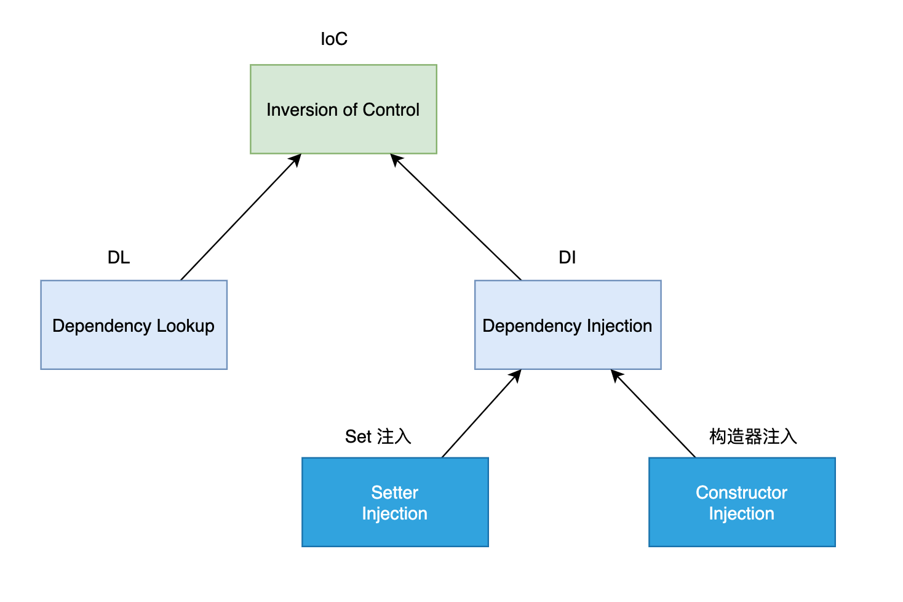

**Spring IoC容器实现对象的创建与依赖：**


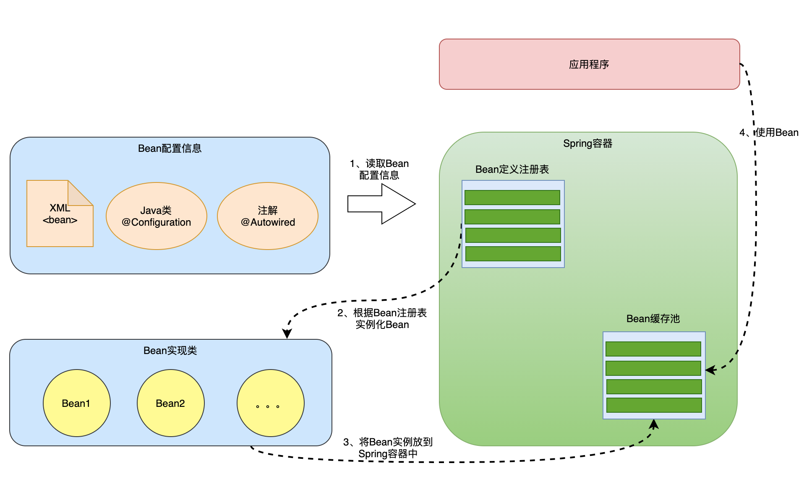

### 2.2、Dubbo中 的 IoC

Dubbo IOC 是通过 setter 方法注入依赖。

Dubbo 首先会通过反射获取到实例的所有方法，然后再遍历方法列表，检测方法名是否具有 setter 方法特征。

若有，则通过 ObjectFactory 获取依赖对象，最后通过反射调用 setter 方法将依赖设置到目标对象中。

整个过程对应的代码如下：

```xml
`private T injectExtension(T instance) {`
    `try {`
        `if (objectFactory != null) {`
            `// 遍历目标类的所有方法`
            `for (Method method : instance.getClass().getMethods()) {`
                `// 检测方法是否以 set 开头，且方法仅有一个参数，且方法访问级别为 public`
                `if (method.getName().startsWith("set")`
                    `&& method.getParameterTypes().length == 1`
                    `&& Modifier.isPublic(method.getModifiers())) {`
                    `// 获取 setter 方法参数类型`
                    `Class<?> pt = method.getParameterTypes()[0];`
                    `try {`
                        `// 获取属性名，比如 setName 方法对应属性名 name`
                        `String property = method.getName().length() > 3 ?`
                            `method.getName().substring(3, 4).toLowerCase() +`
                                `method.getName().substring(4) : "";`
                        `// 从 ObjectFactory 中获取依赖对象`
                        `Object object = objectFactory.getExtension(pt, property);`
                        `if (object != null) {`
                            `// 通过反射调用 setter 方法设置依赖`
                            `method.invoke(instance, object);`
                        `}`
                    `} catch (Exception e) {`
                        `logger.error("fail to inject via method...");`
                    `}`
                `}`
            `}`
        `}`
    `} catch (Exception e) {`
        `logger.error(e.getMessage(), e);`
    `}`
    `return instance;`
`}`
```

在上面代码中，objectFactory 变量的类型为 AdaptiveExtensionFactory，AdaptiveExtensionFactory 内部维护了一个 ExtensionFactory 列表，用于存储其他类型的 ExtensionFactory。

Dubbo 目前提供了两种 ExtensionFactory，分别是 SpiExtensionFactory 和 SpringExtensionFactory。前者用于创建自适应的拓展，后者是用于从 Spring 的 IOC 容器中获取所需的拓展。

Dubbo IOC 目前仅支持 setter 方式注入。

## 3、Dubbo中的AOP：

### 3.1、Spring 中的 AOP

**业务效果：**


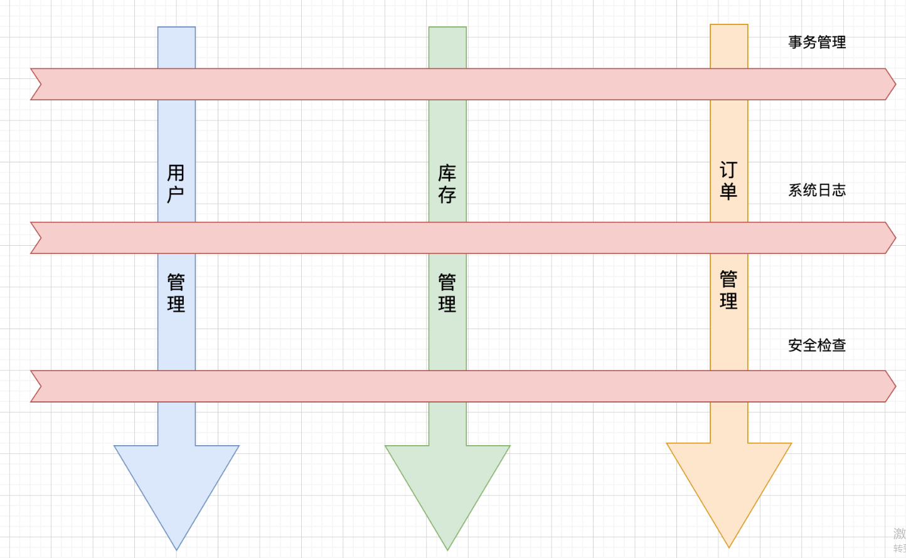

**框架实现：**


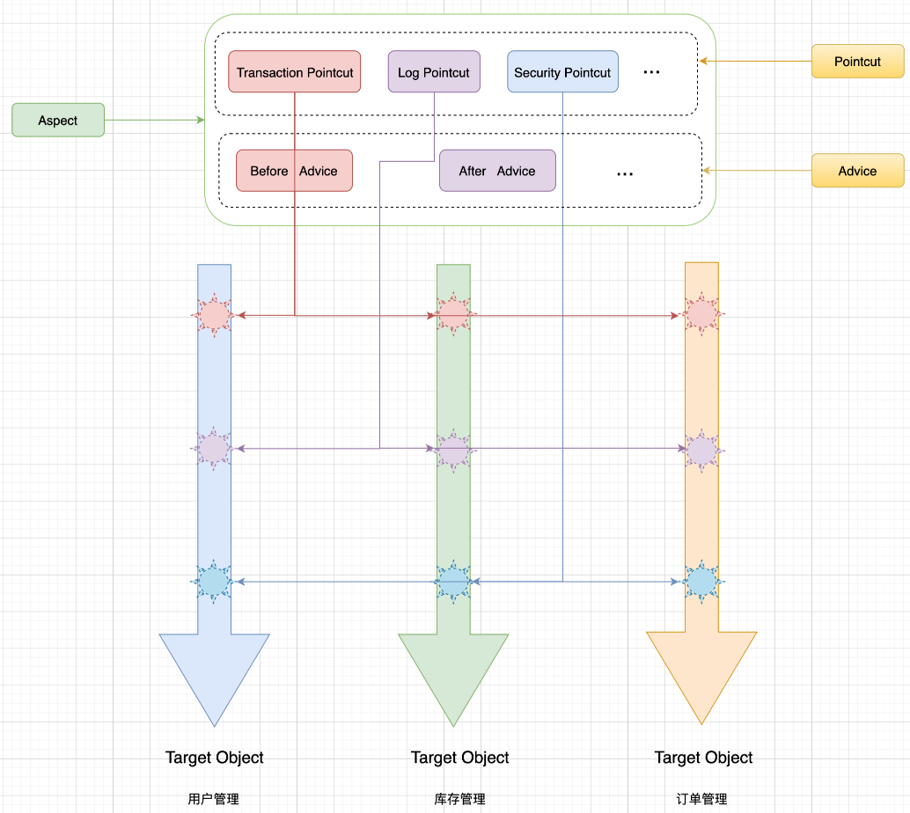

### 3.2、Dubbo 中的 AOP

在Spring AOP中，我们可以使用多个切面对指定类的方法进行增强，在Dubbo中也提供了类似的功能。在Dubbo中你可以指定多个Wrapper类对指定的扩展点的实现类的方法进行增强。

**Wrapper类如何使用**

- 先定义warpper类， 这个类必须实现SPI接口
- warpper类的构造方法必须传入SPI接口的参数
- wrapper类必须加入META-INF/dubbo目录下的SPI接口的实现文件中
- wrapper类方法的调用顺序是根据META-INF/dubbo目录下的SPI接口的实现文件中顺序配置来的。 在文件上面的先调用，后面的后调用

定义一个SPI接口和默认实现类：


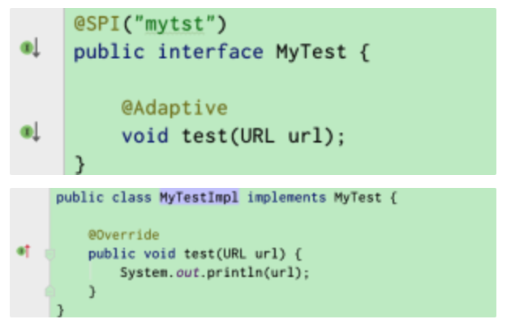

定义两个wrapper拦截器：


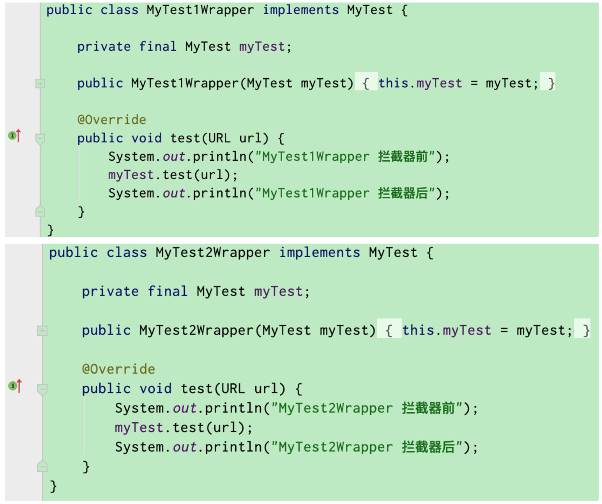

配置好拦截器和SPI实现类：




在目录 META-INF/dubbo/internal 下增加SPI接口命名的文件：

```xml
`mytst=org.apache.dubbo.common.extension.wrapper.impl.MyTestImpl`

`wrapper1=org.apache.dubbo.common.extension.wrapper.MyTest1Wrapper`

`wrapper2=org.apache.dubbo.common.extension.wrapper.MyTest2Wrapper`
```

调用SPI接口的实现类测试：


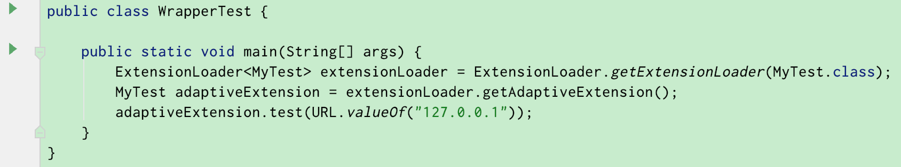

运行结果如下：


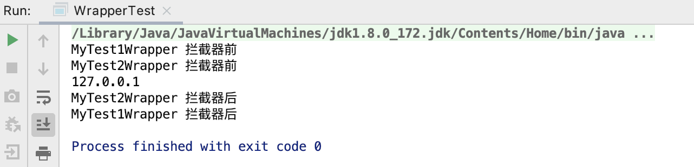

**实现原理**

1、加载wrapper类

wrapper类也是实现了SPI的接口类，会被SPI机制加载到缓存中。


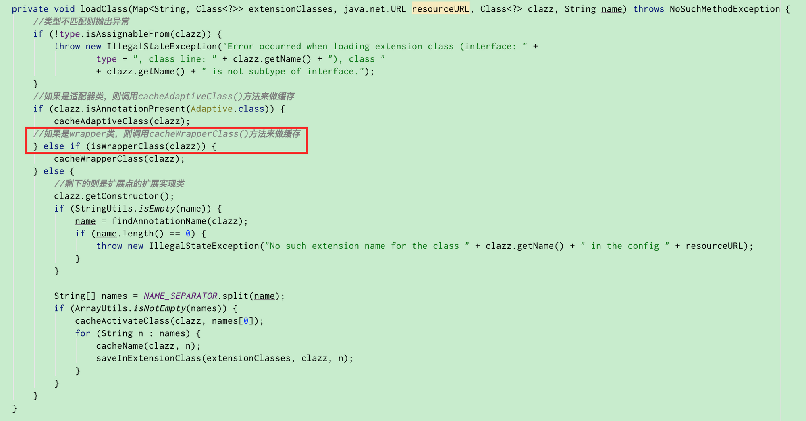


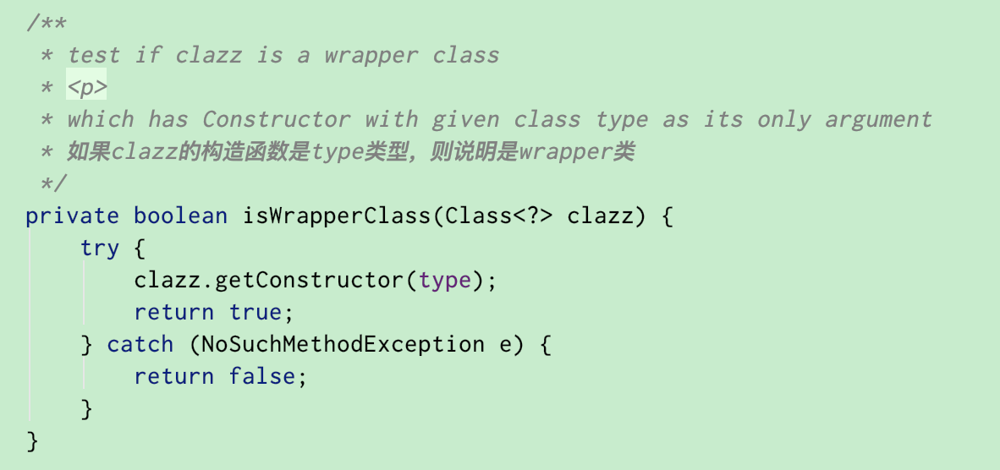

2、获取代理类

获取接口的适配器类，具体使用哪个SPI的实现还是看我们传入的URL参数中定义的实现类，如果URL中参数没有定义，就会使用SPI的默认实现类。


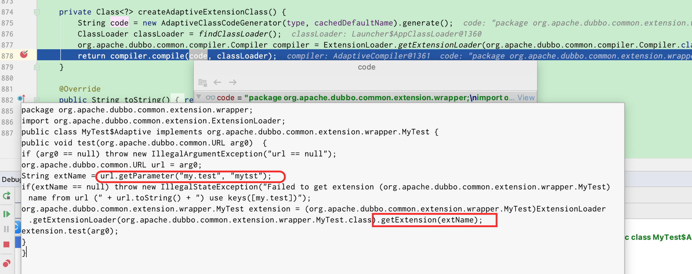

3、获取真实的扩展类

extensionLoader.getExtension(“mytst”);


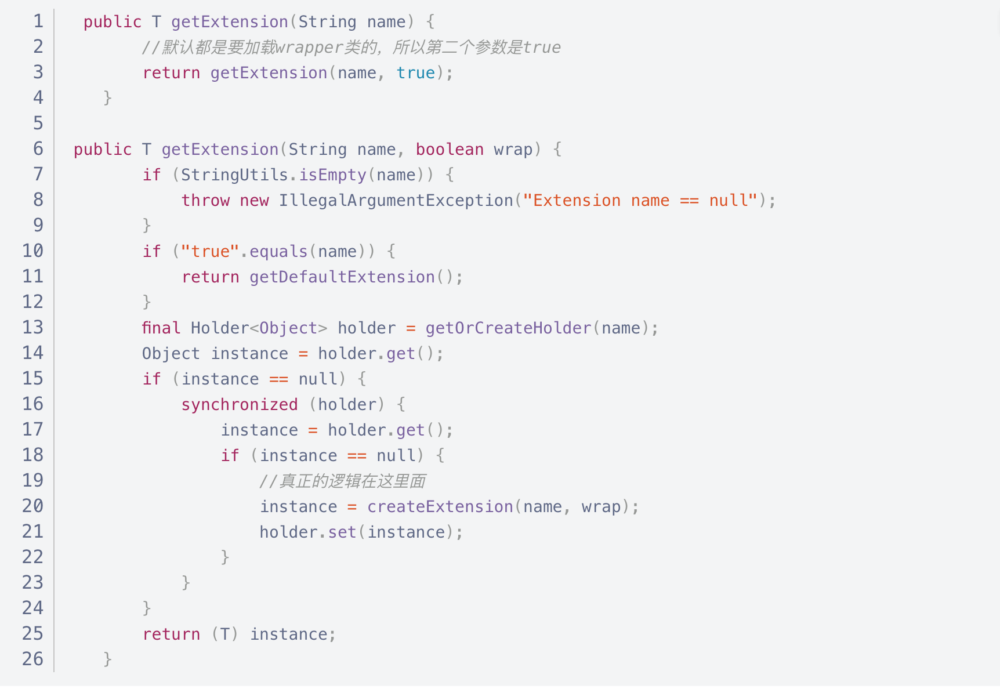

逻辑很简单， 就是前面校验缓存中是否已经有这个SPI扩展类的，如果没有就创建。

**createExtension**方法：


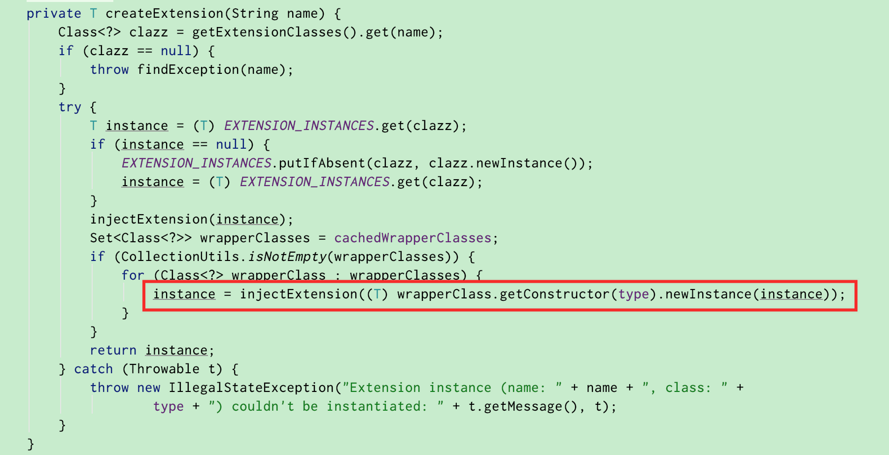


上面的代码遍历了所有Wrapper类，并使用injectExtension一层层对扩展实现类进行功能增强。

## 4、Dubbo与Spring的整合：

### 4.1、Spring 自定义配置

完成一个Spring的自定义配置一般需要5步：

1. 设计配置属性和JavaBean
2. 编写XSD(XML Schema)文件,它就是一个校验XML，定义了一些列的语法来规范XML
3. 编写NameSpaceHandler和BeanDefinitionParser完成解析工作
4. 编写spring。handlers和spring.schemas串联起所有部件
5. 在Bean文件中应用

具体demo参见：https://www.cnblogs.com/huan30/p/12790406.html

### 4.2、Dubbo 实现 Spring 自定义配置


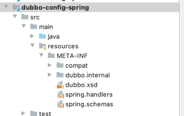


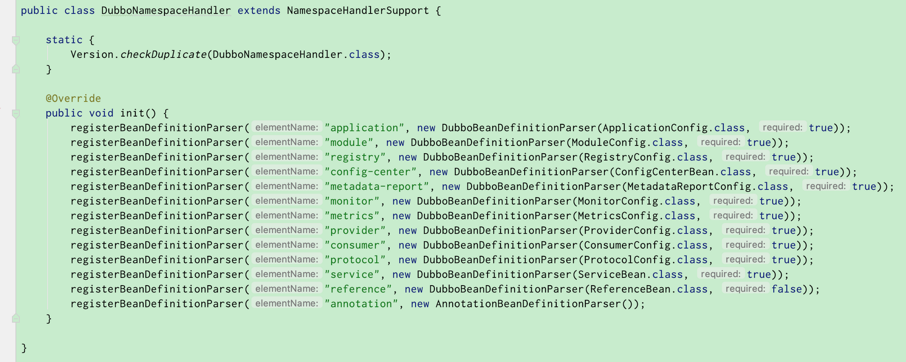

### 4.3、Dubbo 与 Spring 的整合


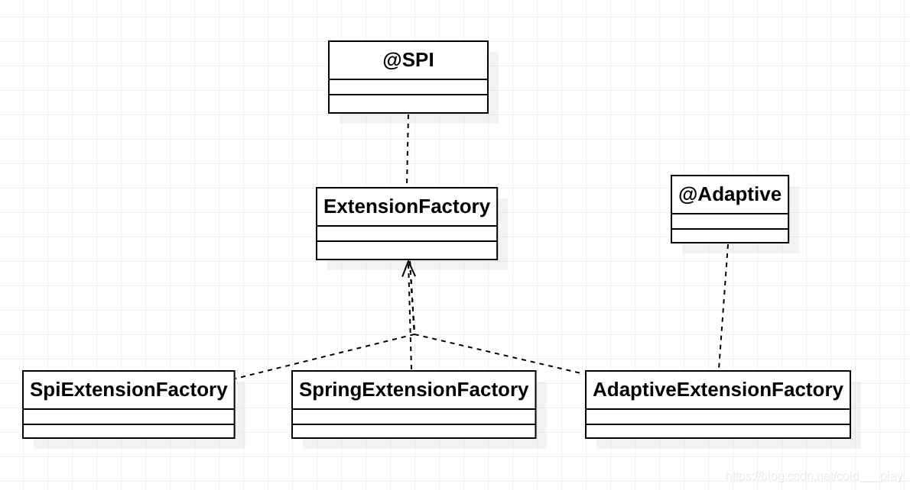

AdaptiveExtensionFactory持有了所有的具体工厂实现，它的getExtesion方法中只是遍历了它持有的所有工厂，最终还是调动SPI或Spring工厂实现的getExtesion方法：


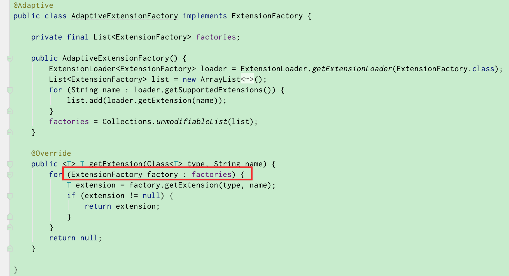

具体在SpringExtensionFactory中，通过在Spring容器中通过name找到bean：


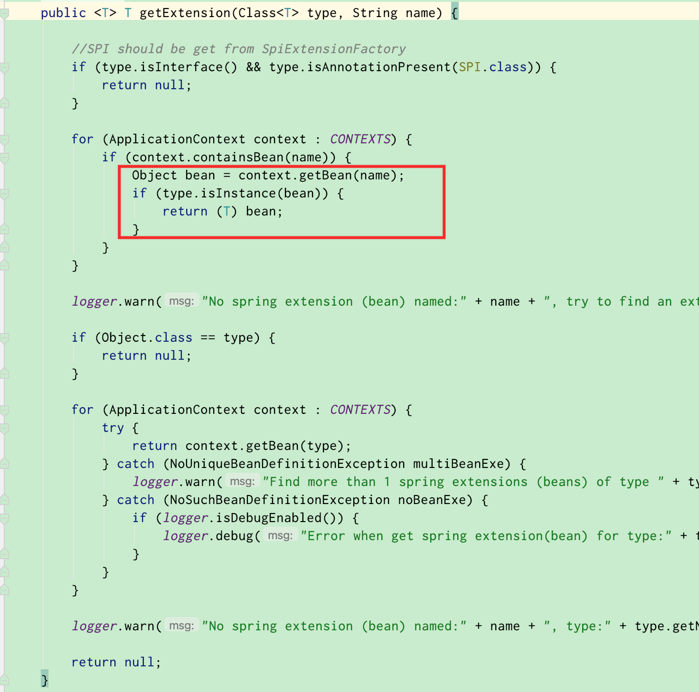

**参考链接：**

[Spring IOC 知识点总结，写得太好了！](https://mp.weixin.qq.com/s?src=11&timestamp=1622721717&ver=3108&signature=arFswO5GtWE50sQ3yHkuQX9USuLSGrZYyRyiVAAo1VHo*mGkTOGYjARZ*3uVe4bPw*85THwcljOWlsiFraft34RsnsE9EFsXrL-oGP6HAHN7-JCDryHmmaqWcHgcvhby&new=1)

[Dubbo SPI](https://dubbo.apache.org/zh/docs/v2.7/dev/source/dubbo-spi/)

[实现一个简易版的 Spring之如何实现 AOP](https://www.toutiao.com/a6965453857132462596/?channel=&source=search_tab)

[深入剖析ApacheDubbo核心技术内幕](https://weread.qq.com/web/appreader/ba53238071bc6e98ba52203?wfrom=app&wtheme=white&wvid=20014178&sence=bottomSheetShare)

[Dubbo的Wrapper类原理接口 -- 实现类似AOP的效果](https://blog.csdn.net/leisurelen/article/details/108114769)

[Dubbo——ExtensionFactory的实现原理](https://blog.csdn.net/cold___play/article/details/107024429)

[Dubbo源码解析-ExtensionFactory](https://blog.csdn.net/sinat_34976604/article/details/86757638)
