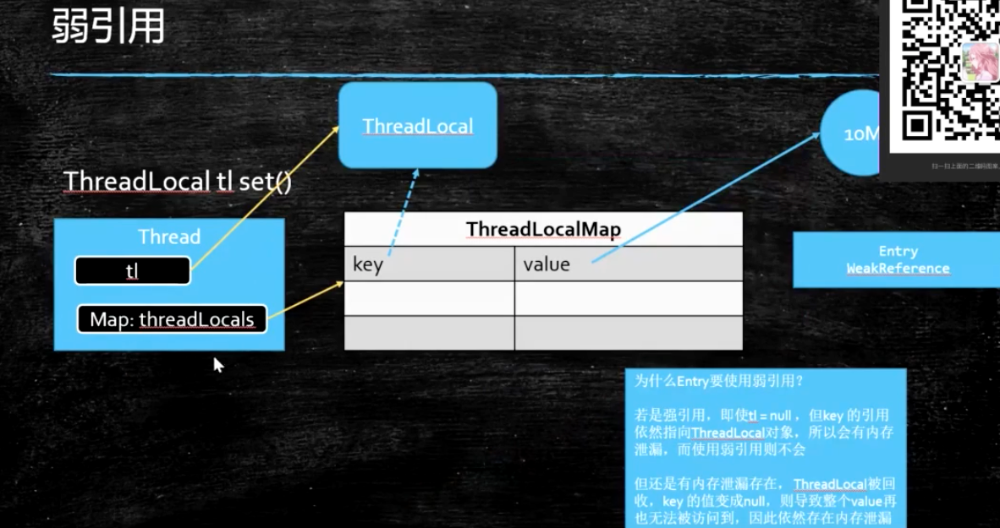
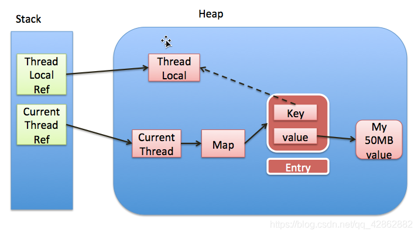
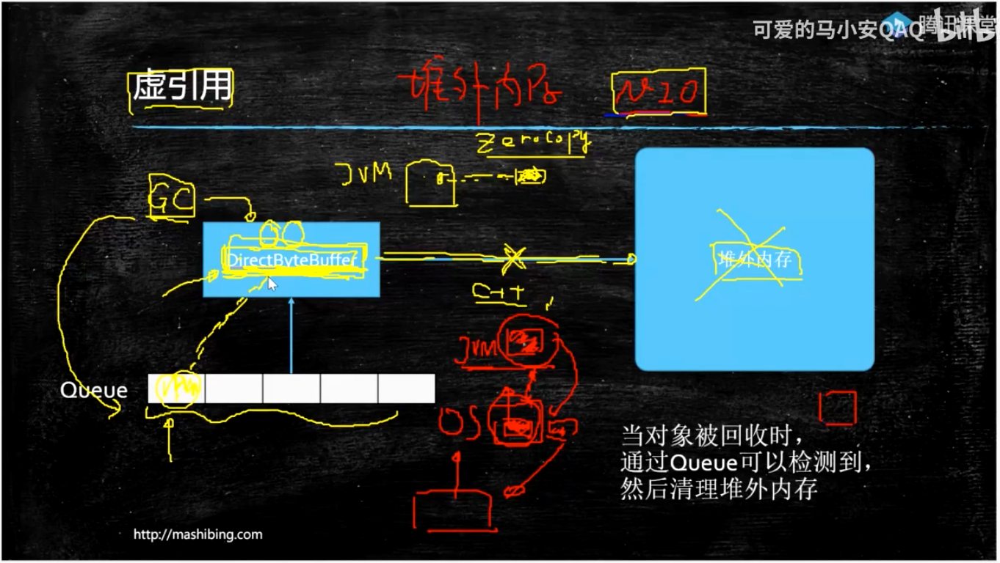

本文介绍一下Java中的几种引用类型。
<!--more-->

## 强引用

```
M m = new M();
```

 

## 软引用

```
SoftReference<byte[]> m = new SoftReference<>(new byte[1024]);
System.out.println(m.get());
```

当内存不够当时候，就会被垃圾回收；

实际应用在缓存之中；

 

## 弱引用

```
WeakReference<M> m = new WeakReference(new M());
System.out.println(m.get());
```

一旦经过垃圾回收，立即会被回收到；

应用在ThreadLocal中；

Spring中的事务，为了保证多个方法也要在同一个数据库连接池的连接，就是要用一个ThreadLocal去实现；






一旦线程结束的时候，线程里边的tl对象也会被回收，如果key是一个强引用，则ThreadLocal则不会被回收，只有是一个弱引用，才会被回收；

 

但是key被回收了，key变成null，但是其对应的value没法被回收，必须手动执行tl.remove()操作，不然还会产生内存泄漏；

 

为什么同时要有弱引用和remove方法，因为这两个是不同的对象，一个是ThreadLocal，另一个是Entry对象；






 

 

WeakHashMap也是弱引用的引用；

 

## 虚引用

```
ReferenceQueue<M> QUEUE = new ReferenceQueue();
PhantomReference<M> phantomReference = new PhantomReference<>(new M(), QUEUE);
System.out.println(phantomReference.get());
```

无法通过get方法获得值；

虚引用的作用是用于管理对外内存；

NIO中的直接内存管理，直接管理对外的内存，叫做Zero-Copy；






DirectByteBuffer一旦被回收，对应的堆外内存也要被回收，否则会出现内存泄漏问题；

凡是这样的对象，给它挂一个虚引用，只要这个对象被回收，则会设置一个信息到一个队列里边，这样JVM就只需监听这个队列就可以回收对应到堆外内存；
