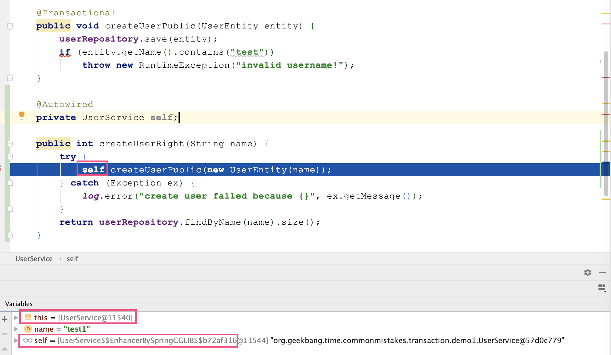

# Spring中的事务使用注意事项

Spring 针对 Java Transaction API (JTA)、JDBC、Hibernate 和 Java Persistence API (JPA) 等事务 API，实现了一致的编程模型，而 Spring 的声明式事务功能更是提供了极其方便的事务配置方式，配合 Spring Boot 的自动配置，大多数 Spring Boot 项目只需要在方法上标记 @Transactional 注解，即可一键开启方法的事务性配置。


写法一：

```
@Service
@Slf4j
public class UserService {
    @Autowired
    private UserRepository userRepository;

    //一个公共方法供Controller调用，内部调用事务性的私有方法
    public int createUserWrong1(String name) {
        try {
            this.createUserPrivate(new UserEntity(name));
        } catch (Exception ex) {
            log.error("create user failed because {}", ex.getMessage());
        }
        return userRepository.findByName(name).size();
    }

    //标记了@Transactional的private方法
    @Transactional
    private void createUserPrivate(UserEntity entity) {
        userRepository.save(entity);
        if (entity.getName().contains("test"))
            throw new RuntimeException("invalid username!");
    }

    //根据用户名查询用户数
    public int getUserCount(String name) {
        return userRepository.findByName(name).size();
    }
}
```


 **@Transactional 生效原则 1，除非特殊配置（比如使用 AspectJ 静态织入实现 AOP），否则只有定义在 public 方法上的 @Transactional 才能生效**


写法二：

```
public int createUserWrong2(String name) {
    try {
        this.createUserPublic(new UserEntity(name));
    } catch (Exception ex) {
        log.error("create user failed because {}", ex.getMessage());
    }
  return userRepository.findByName(name).size();
}

//标记了@Transactional的public方法
@Transactional
public void createUserPublic(UserEntity entity) {
    userRepository.save(entity);
    if (entity.getName().contains("test"))
        throw new RuntimeException("invalid username!");
}
```


**@Transactional 生效原则 2，必须通过代理过的类从外部调用目标方法才能生效**





### 

### 事务即便生效也不一定能回滚

通过 AOP 实现事务处理可以理解为，使用 try…catch…来包裹标记了 @Transactional 注解的方法，**当方法出现了异常并且满足一定条件的时候**，在 catch 里面我们可以设置事务回滚，没有异常则直接提交事务。

这个的一定条件满足以下两条：

- 只有异常传播出了标记了 @Transactional 注解的方法，事务才能回滚
- 默认情况下，出现 RuntimeException（非受检异常）或 Error 的时候，Spring 才会回滚事务。


```
try {
   // This is an around advice: Invoke the next interceptor in the chain.
   // This will normally result in a target object being invoked.
   retVal = invocation.proceedWithInvocation();
}
catch (Throwable ex) {
   // target invocation exception
   completeTransactionAfterThrowing(txInfo, ex);
   throw ex;
}
finally {
   cleanupTransactionInfo(txInfo);
}
```


```
/**
 * The default behavior is as with EJB: rollback on unchecked exception
 * ({@link RuntimeException}), assuming an unexpected outcome outside of any
 * business rules. Additionally, we also attempt to rollback on {@link Error} which
 * is clearly an unexpected outcome as well. By contrast, a checked exception is
 * considered a business exception and therefore a regular expected outcome of the
 * transactional business method, i.e. a kind of alternative return value which
 * still allows for regular completion of resource operations.
 * <p>This is largely consistent with TransactionTemplate's default behavior,
 * except that TransactionTemplate also rolls back on undeclared checked exceptions
 * (a corner case). For declarative transactions, we expect checked exceptions to be
 * intentionally declared as business exceptions, leading to a commit by default.
 * @see org.springframework.transaction.support.TransactionTemplate#execute
 */
@Override
public boolean rollbackOn(Throwable ex) {
   return (ex instanceof RuntimeException || ex instanceof Error);
}
```


写法三：

```
@Service
@Slf4j
public class UserService {
    @Autowired
    private UserRepository userRepository;
    
    //异常无法传播出方法，导致事务无法回滚
    @Transactional
    public void createUserWrong1(String name) {
        try {
            userRepository.save(new UserEntity(name));
            throw new RuntimeException("error");
        } catch (Exception ex) {
            log.error("create user failed", ex);
        }
    }

    //即使出了受检异常也无法让事务回滚
    @Transactional
    public void createUserWrong2(String name) throws IOException {
        userRepository.save(new UserEntity(name));
        otherTask();
    }

    //因为文件不存在，一定会抛出一个IOException
    private void otherTask() throws IOException {
        Files.readAllLines(Paths.get("file-that-not-exist"));
    }
}
```


改动一：

```
@Transactional
public void createUserRight1(String name) {
    try {
        userRepository.save(new UserEntity(name));
        throw new RuntimeException("error");
    } catch (Exception ex) {
        log.error("create user failed", ex);
        TransactionAspectSupport.currentTransactionStatus().setRollbackOnly();
    }
}
```


改动二：

```
@Transactional(rollbackFor = Exception.class)
public void createUserRight2(String name) throws IOException {
    userRepository.save(new UserEntity(name));
    otherTask();
}
```


> 我们期望子用户的注册作为一个事务单独回滚，不影响主用户的注册，这样的逻辑可以实现吗？

代码实现：

```
//设置 REQUIRES_NEW 方式的事务传播策略，也就是执行到这个方法时需要开启新的事务，并挂起当前事务
@Transactional(propagation = Propagation.REQUIRES_NEW)
public void createSubUserWithExceptionRight(UserEntity entity) {
    log.info("createSubUserWithExceptionRight start");
    userRepository.save(entity);
    throw new RuntimeException("invalid status");
}
 

@Transactional
public void createUserRight(UserEntity entity) {
    createMainUser(entity);
    try{
        subUserService.createSubUserWithExceptionRight(entity);
    } catch (Exception ex) {
        // 捕获异常，防止主方法回滚
        log.error("create sub user error:{}", ex.getMessage());
    }
}
```


```
transactionService.execTransaction(() -> {
    ActivityBatch activityBatch1 = new ActivityBatch();
    activityBatch1.setId(activityBatchId);
    activityBatch1.setIsCancelTime(YN.Y.getCode());
    activityBatch1.setBatchLockStatus(ActivityBatchLockStatusEnum.BATCH_LOCK_STATUS_CLOSE.getCode());
    activityBatchMapper.updateById(activityBatch1);
    activityBatchMapper.batchDeleteByIds(editor, Lists.newArrayList(activityBatchId));
    activityBatchSpecPriceMapper.cancelByBatchId(editor, batchId, activityId, HmcOperationTypeEnum.HMC_CANCEL_ACTIVITY_BATCH.name());
    return true;
});
```


总结一下就是：

**1、事务慎用；**

**2、事务内部严禁RPC调用；**

**3、事务注解需要显式指定rollbackFor的异常；**

**4、事务要保持原子性；**